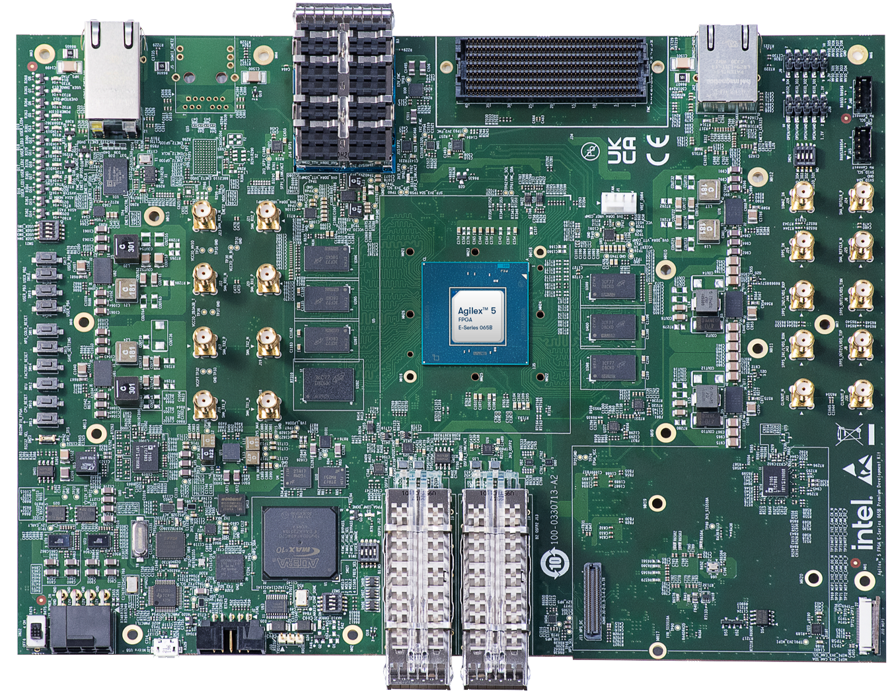
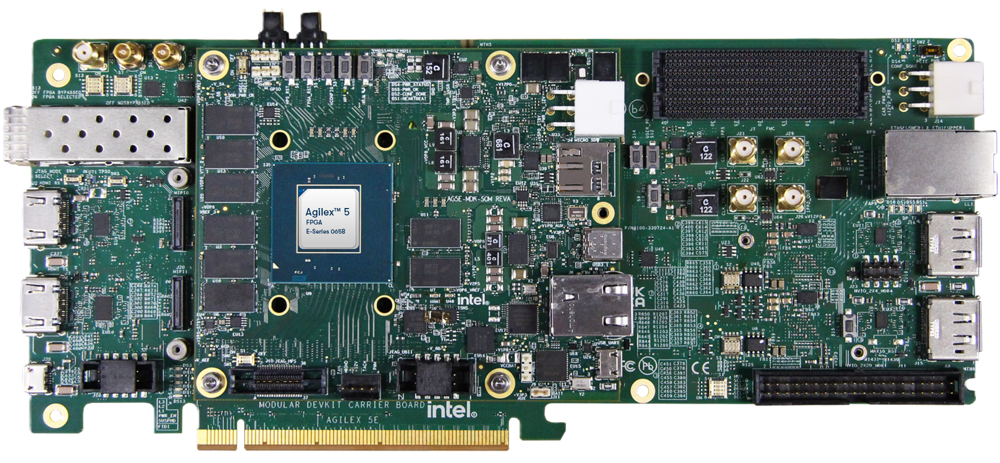
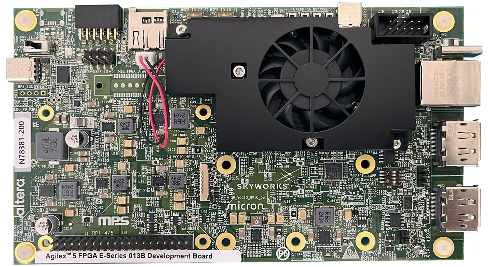

# Agilex 5 E-Series Golden Hardware Reference Design (GHRD)

This repository contains Golden Hardware Reference Design (GHRD) for Agilex 5 E-Series System On Chip (SoC) FPGA.
The GHRD is part of the Golden System Reference Design (GSRD), which provides a complete solution, including exercising soft IP in the fabric, booting to U-Boot, then Linux, and running sample Linux applications.
Refer to the [Agilex 5 E-Series Premium Development Kit GSRD](https://altera-fpga.github.io/latest/embedded-designs/agilex-5/e-series/premium/gsrd/ug-gsrd-agx5e-premium/) and [Agilex 5 E-Series Modular Development Kit GSRD](https://altera-fpga.github.io/latest/embedded-designs/agilex-5/e-series/modular/gsrd/ug-gsrd-agx5e-modular/) for information about GSRD.

The [designs](#designs) are stored in individual folders. Each design can be opened, modified and compiled by using Quartus Prime software.
GHRD releases are created for each version of Quartus Prime Software. It is recommended to use the release for your version of Quartus Prime.
These reference designs demonstrate the system integration between Hard Processor System (HPS) and FPGA IPs.

## Baseline feature
This is applicable to all designs.
- Hard Processor System (HPS) enablement and configuration
  - Enable dual core Arm Cortex-A76 processor
  - Enable dual core Arm Cortex-A55 processor
  - HPS Peripheral and I/O. eg, NAND, SD/MMC, EMAC, USB, SPI, I2C, UART, and GPIO. (depends on the daughter card).
  - HPS Clock and Reset
  - HPS FPGA Bridge and Interrupt
    - Note: The System MMU port in F2H and F2SDRAM bridges are disabled by default in baseline design, unless otherwise specified.
- HPS EMIF configuration (starting 25.1.1 ECC is enabled by default)
- System integration with FPGA IPs
  - Peripheral subsystem that consists of System ID, Programmable I/O (PIO) IP for controlling DIPSW, PushButton, and LEDs.
  - Debug subsystem that consists of JTAG-to-Avalon Master IP to allow System-Console debug activity and FPGA content access through JTAG
  - 256KB of FPGA On-Chip Memory

## Advanced feature
This is only applicable if the feature is enabled.
- Time-Sensitive Networking (TSN): PHY configuration 2 (RGMII from FPGA HVIO)

## Dependency
* Altera Quartus Prime 26.1
* Supported Altera Development Kit
  - Agilex 5 FPGA E-Series 065B Premium Development Kit (ES) DK-A5E065BB32AES1
  - Agilex 5 FPGA E-Series 065B Premium Development Kit DK-A5E065BB32AEA
  - Agilex 5 FPGA E-Series 065A Premium Development Kit DK-A5E065AB32AEA
  
  - Agilex 5 FPGA E-Series 065B Modular Development Kit (ES) MK-A5E065BB32AES1
  - Agilex 5 FPGA E-Series 065B Modular Development Kit MK-A5E065BB32AEA
  - Agilex 5 FPGA E-Series 065A Modular Development Kit MK-A5E065AB32AEA
  
  - Agilex 5 FPGA E-Series 013B Development Kit DK-A5E013BM16AEA
  

## Tested Platform for the GHRD Build Flow
* SUSE Linux Enterprise Server 15 SP4

## Setup

Several tools are required to be in the path.

* Altera Quartus Prime 26.1
* Python 3.11.5 (only required when using command line to build)

### Example Setup for Altera Quartus Prime tools
This is recommended, when using command line to build.
```bash
export QUARTUS_ROOTDIR=~/alteraFPGA_pro/26.1/quartus
```
Note: Adapt the path above to where Quartus Prime is installed.

```bash
export PATH="$QUARTUS_ROOTDIR/bin:$QUARTUS_ROOTDIR/../qsys/bin:$QUARTUS_ROOTDIR/../niosv/bin:$QUARTUS_ROOTDIR/sopc_builder/bin:$QUARTUS_ROOTDIR/../questa_fe/bin:$QUARTUS_ROOTDIR/../syscon/bin:$QUARTUS_ROOTDIR/../riscfree/RiscFree:$PATH"'
```

## Quick start

### Using command line
- To build the design using command line, refer to the README in each [designs](#designs) for instructions to run the desired make command.

### Using Quartus GUI
- Launch Quartus.
- Open the project. Example: a5ed065es-premium-devkit-oobe/baseline-a55/top.qpf
- Click the play button to compile the design.
- The compiled sof can be found in output_files folder of the project path.

### Notes
- Command line and Quartus GUI should not be used intertwined.
- Mixing both design build flows might not generate some fileset correctly and fail the build.


## Designs

### Agilex 5 FPGA E-Series 065B Premium Development Kit (ES) DK-A5E065BB32AES1
Refer to the individual readme for details of the design.

* [a5ed065es-premium-devkit-oobe/baseline-a55](a5ed065es-premium-devkit-oobe/baseline-a55/README.md) :
  Baseline-A55 GHRD for the A5ED065B ES Premium Devkit with HPS Enablement Expansion Board.
  This design boots from Arm Cortex-A55 core 0 processor.

* [a5ed065es-premium-devkit-oobe/baseline-a76](a5ed065es-premium-devkit-oobe/baseline-a76/README.md) :
  Baseline-A76 GHRD for the A5ED065B ES Premium Devkit with HPS Enablement Expansion Board.
  This design boots from Arm Cortex-A76 core 2 processor.

* [a5ed065es-premium-devkit-oobe/legacy-tsn-cfg2](a5ed065es-premium-devkit-oobe/legacy-tsn-cfg2/README.md) :
  Legacy TSN-CFG2 GHRD for the A5ED065B ES Premium Devkit with HPS Enablement Expansion Board.
  This design enables RGMII from FPGA HVIO for TSN PHY configuration 2.

* [a5ed065es-premium-devkit-debug2/legacy-baseline](a5ed065es-premium-devkit-debug2/legacy-baseline/README.md) :
  Legacy baseline GHRD for the A5ED065B ES Premium Devkit with HPS Test Board.

* [a5ed065es-premium-devkit-emmc/legacy-baseline](a5ed065es-premium-devkit-emmc/legacy-baseline/README.md) :
  Legacy baseline GHRD for the A5ED065B ES Premium Devkit with HPS NAND Board (This board also offers eMMC).

### Agilex 5 FPGA E-Series 065B Modular Development Kit (ES) MK-A5E065BB32AES1

* [a5ed065es-modular-devkit-som/baseline-a55](a5ed065es-modular-devkit-som/baseline-a55/README.md) :
  Baseline-A55 GHRD for the A5ED065B ES Modular Devkit.

### Agilex 5 FPGA E-Series 013B Development Kit DK-A5E013BM16AEA

* [a5ed013-devkit-oobe/baseline-a55](a5ed013-devkit-oobe/baseline-a55/README.md) :
  Baseline GHRD for the A5ED013B Development Kit.

### Agilex 5 FPGA E-Series 065B Premium Development Kit DK-A5E065BB32AEA

* [a5ed065b-premium-devkit-oobe/baseline-a55](a5ed065b-premium-devkit-oobe/baseline-a55/README.md) :
  Baseline-A55 GHRD for the A5ED065B Premium Devkit with HPS Enablement Expansion Board.
  This design boots from Arm Cortex-A55 core 0 processor.

* [a5ed065b-premium-devkit-oobe/baseline-a76](a5ed065b-premium-devkit-oobe/baseline-a76/README.md) :
  Baseline-A76 GHRD for the A5ED065B Premium Devkit with HPS Enablement Expansion Board.
  This design boots from Arm Cortex-A76 core 2 processor.

* [a5ed065b-premium-devkit-oobe/tsn-cfg2](a5ed065b-premium-devkit-oobe/tsn-cfg2/README.md) :
  TSN-CFG2 GHRD for the A5ED065B Premium Devkit with HPS Enablement Expansion Board.
  This design enables RGMII from FPGA HVIO for TSN PHY configuration 2.

* [a5ed065b-premium-devkit-debug2/baseline-a55](a5ed065b-premium-devkit-debug2/baseline-a55/README.md) :
  Baseline-A55 GHRD for the A5ED065B Premium Devkit with HPS Test Board.

* [a5ed065b-premium-devkit-emmc/baseline-a55](a5ed065b-premium-devkit-emmc/baseline-a55/README.md) :
  Baseline-A55 GHRD for the A5ED065B Premium Devkit with HPS NAND Board (This board also offers eMMC).

### Agilex 5 FPGA E-Series 065B Modular Development Kit MK-A5E065BB32AEA

* [a5ed065b-modular-devkit-som/baseline-a55](a5ed065b-modular-devkit-som/baseline-a55/README.md) :
  Baseline-A55 GHRD for the A5ED065B Modular Devkit.

### Agilex 5 FPGA E-Series 065A Premium Development Kit DK-A5E065AB32AEA

* [a5ed065a-premium-devkit-oobe/baseline-a55](a5ed065a-premium-devkit-oobe/baseline-a55/README.md) :
  Baseline-A55 GHRD for the A5ED065A Premium Devkit with HPS Enablement Expansion Board.
  This design boots from Arm Cortex-A55 core 0 processor.

* [a5ed065a-premium-devkit-oobe/baseline-a76](a5ed065a-premium-devkit-oobe/baseline-a76/README.md) :
  Baseline-A76 GHRD for the A5ED065A Premium Devkit with HPS Enablement Expansion Board.
  This design boots from Arm Cortex-A76 core 2 processor.

* [a5ed065a-premium-devkit-oobe/tsn-cfg2](a5ed065a-premium-devkit-oobe/tsn-cfg2/README.md) :
  TSN-CFG2 GHRD for the A5ED065A Premium Devkit with HPS Enablement Expansion Board.
  This design enables RGMII from FPGA HVIO for TSN PHY configuration 2.

* [a5ed065a-premium-devkit-debug2/baseline-a55](a5ed065a-premium-devkit-debug2/baseline-a55/README.md) :
  Baseline-A55 GHRD for the A5ED065A Premium Devkit with HPS Test Board.

* [a5ed065a-premium-devkit-emmc/baseline-a55](a5ed065a-premium-devkit-emmc/baseline-a55/README.md) :
  Baseline-A55 GHRD for the A5ED065A Premium Devkit with HPS NAND Board (This board also offers eMMC).

### Agilex 5 FPGA E-Series 065A Modular Development Kit MK-A5E065AB32AEA

* [a5ed065a-modular-devkit-som/baseline-a55](a5ed065a-modular-devkit-som/baseline-a55/README.md) :
  Baseline-A55 GHRD for the A5ED065A Modular Devkit.
