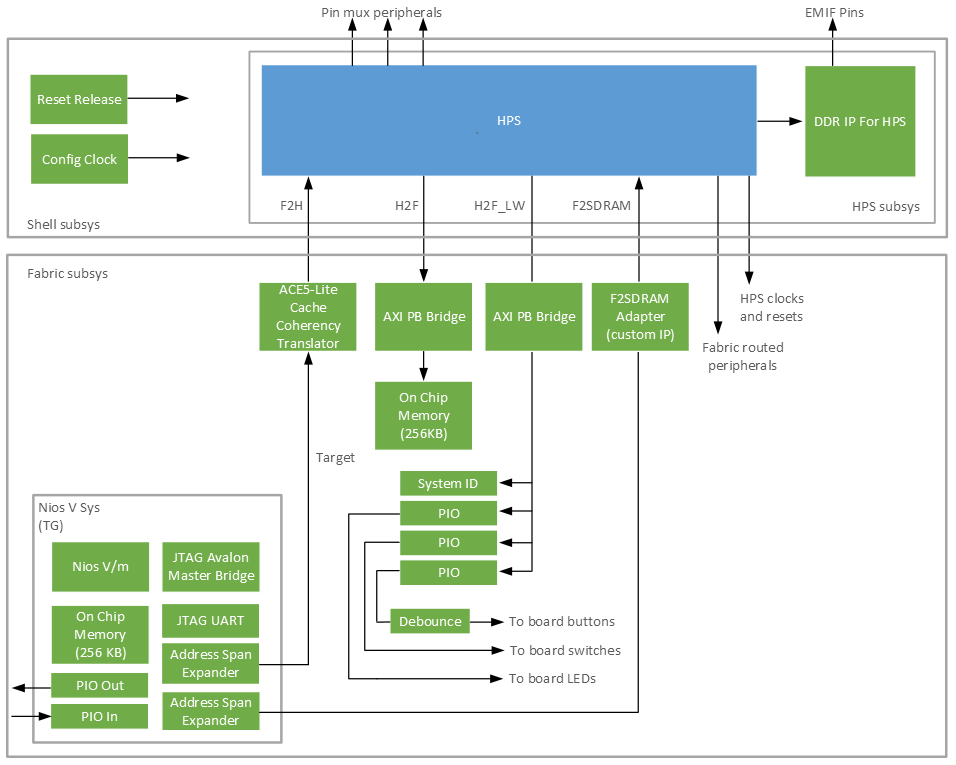

# HPS Baseline System Example Design with HPS Expansion Board for Agilex 5 FPGA E-Series 065B Premium Development Kit

HPS Baseline System Example Design for Agilex 5 FPGA E-Series 065B Premium Development Kit with Out of Box Experience (OOBE) daughter card, which is also known as HPS Enablement Expansion Board.

## Description

Agilex 5 GHRD is a reference design for Altera Agilex 5 System On Chip (SoC) FPGA.

The GHRD is part of the Golden System Reference Design (GSRD), which provides a complete solution, including exercising soft IP in the fabric, booting to U-Boot, then Linux, and running sample Linux applications.
Refer to the [Agilex 5 E-Series Premium Development Kit GSRD](https://altera-fpga.github.io/latest/embedded-designs/agilex-5/e-series/premium/gsrd/ug-gsrd-agx5e-premium/) for information about GSRD.

The design uses HPS First configuration mode.

## Baseline feature
This reference design demonstrates the following system integration between Hard Processor System (HPS) and FPGA IPs:
- Hard Processor System (HPS) enablement and configuration
  - Enable dual core Arm Cortex-A76 processor
  - Enable dual core Arm Cortex-A55 processor
  - HPS Peripheral and I/O (SD/MMC, EMAC, MDIO, USB, I3C, JTAG, UART, and GPIO)
  - HPS Clock and Reset
  - HPS FPGA Bridge and Interrupt
- HPS EMIF configuration (starting 25.1.1 ECC is enabled by default)
- System integration with FPGA IPs
  - Core subsystem that consists of NiosV subsystem, 256KB of FPGA On-Chip Memory, System ID, Programmable I/O (PIO) IP for controlling DIPSW, PushButton, and LEDs.
  - NiosV subsystem that consists of JTAG Avalon Master Bridge IP and Address Span Extender IP to allow System-Console debug activity and FPGA content access through JTAG.

### USB modes
This design supports USB 3.1 in both host and device mode.
Once power up, the USB mode will remain and cannot be changed during runtime.

The linux device tree (dts) needs to be configured.
The dts can be set with "dr_mode".

| dr_mode value | Equivalent USB mode |
| :-- | :-- |
| host | Host |
| peripheral | Device |

## Project Details

- **Family**: Agilex 5 E-Series
- **Quartus Version**: 25.3
- **Development Kit**: Agilex 5 FPGA E-Series 065B Premium Development Kit DK-A5E065BB32AES1
- **Device Part**: A5ED065BB32AE6SR0
- **Category**: HPS
- **Source**: Quartus Prime Pro
- **URL**: https://www.github.com/altera-fpga/agilex5e-ed-gsrd
- **Design Package**: a5ed065es-premium-devkit-oobe-baseline.zip
- **Documentations**: https://altera-fpga.github.io/latest/embedded-designs/agilex-5/e-series/premium/gsrd/ug-gsrd-agx5e-premium/

## Documentations

- **Title**: HPS GSRD User Guide for the Agilex 5 E-Series Premium Development Kit
**URL**: https://altera-fpga.github.io/latest/embedded-designs/agilex-5/e-series/premium/gsrd/ug-gsrd-agx5e-premium/
- **Title**: GHRD README for the Agilex 5 E-Series Premium Development Kit
**URL**: https://github.com/altera-fpga/agilex5e-ed-gsrd/blob/main/a5ed065es-premium-devkit-oobe/baseline/README.md


## GHRD Overview


## Hard Processor System (HPS)
The GHRD HPS configuration matches the board schematic.
Refer to [Agilex 5 Hard Processor System Technical Reference Manual](https://www.intel.com/content/www/us/en/docs/programmable/814346/current) and [Hard Processor System Component Reference Manual: Agilex 5 SoCs](https://www.intel.com/content/www/us/en/docs/programmable/813752/current) for more information on HPS configuration.

## HPS External Memory Interfaces (EMIF) DDR
The GHRD HPS EMIF DDR configuration matches the board schematic.
Refer to [External Memory Interfaces (EMIF) IP User Guide: Agilex 5 FPGAs and SoCs](https://www.intel.com/content/www/us/en/docs/programmable/817467/current) for more information on HPS EMIF configuration.

## Bridges
Bridges are used to move data between FPGA fabric and HPS logic.
Refer to [HPS Bridges](https://www.intel.com/content/www/us/en/docs/programmable/814346/current/bridges.html).

The HPS address map and the FPGA address map are the same for Agilex 5.
Refer to [Total Address Map Graphical](https://www.intel.com/content/www/us/en/docs/programmable/814346/current/total-address-map-graphical.html) for more information.

Therefore, when accessing HPS logic in uboot or linux, the base address would be the same as, when using [NiosV Subsystem](#niosv-subsystem) from FPGA fabric.

| Bridge   | Use Case |
| :-- | :-- |
| F2SDRAM  | move data from FPGA fabric to HPS logic (non-coherent). Can access HPS EMIF. |
| F2S      | move data from FPGA fabric to HPS logic (coherent). Can access all HPS peripherial except the GIC. |
| LWS2F    | move data from HPS logic to FPGA fabric. Access FPGA peripherial Control Status Register (CSR). |
| H2F      | move data from HPS logic to FPGA fabric. Access FPGA Onchip Memory as scratch pad.    |

## Core Subsystem

### NiosV Subsystem
In the NiosV subsystem, the JTAG Avalon Master Bridge IP interface allows access to the peripherals in the FPGA with System Console. This access does not rely on HPS software drivers. Refer to this [Guide](https://www.intel.com/content/www/us/en/docs/programmable/683819/current/analyzing-and-debugging-designs-with-84752.html) for information about system console.

### Peripherals
| Peripheral | Address Offset | Size (bytes) | Attribute | Interrupt Number
| :-- | :-- | :-- | :-- | :-- |
| sysid | 0x0001_0000 | 8 | Unique system ID   | None |
| led_pio | 0x0001_0080 | 16 | LED outputs   | None |
| button_pio | 0x0001_0060 | 16 | Push button inputs | 0 |
| dipsw_pio | 0x0001_0070 | 16 | DIP switch inputs | None |

#### Notes
- There are 4 user DIP switch inputs, 4 user push-button inputs and 4 LED outputs that is connected to fpga pins on Agilex 5 FPGA E-Series 065B Premium Development Kit.
  -  Only the lower three bits of LED outputs are available for software to control. The most significant bit of the LED is used in GHRD top module as heartbeat led. This LED blinks when the fpga design is loaded. Users will not be able to control this LED with HPS software, for example U-Boot or Linux.
- The peripheral components in core subsystem can be accessed via the LWS2F bridge and have offset of 0x0_2000_0000. Refer to [Total Address Map Graphical](https://www.intel.com/content/www/us/en/docs/programmable/814346/current/total-address-map-graphical.html).
- The FPGA IRQ has offset of 17 when mapped to Generic Interrupt Controller (GIC) in device tree structure(dts). Refer to fpga2hps_interrupt_irq0[0] in [GIC Shared Peripheral Interrupts Map for the SoC HPS](https://www.intel.com/content/www/us/en/docs/programmable/814346/current/gic-shared-peripheral-interrupts-map.html).

## Binaries location
After build, the bitstream (sof) can be found in output_files folder.

## Generating FPGA Fabric Configuration (Core RBF)
After the sof is generated, the following command can be run to generate the core.rbf.
```bash
make baseline-install-core-rbf
```
The generated core.rbf can be found in install/binaries folder.

# Yocto Build Setup Guide
1. Refer to [Yocto Linux Build Instructions](software/yocto_linux/README.md#yocto-build) file and follow the steps to build Yocto.

After build, the binaries can be found in the software/yocto_linux_sd or software/yocto_linux_qspi folder.